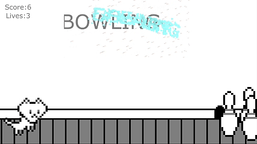
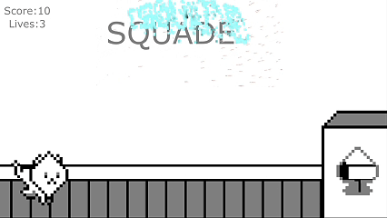

# 🐱 Cat Typing | Typing Parkour Game

> **An interactive typing game combining p5.js game logic with TouchDesigner visual effects.**
> Play as a "liquid" cat causing chaos at home! Type words to avoid obstacles and survive as long as you can.

[](#) [](README.zh-TW.md)



## 🎮 Live Demo

The core logic runs on p5.js. You can try the web prototype here:
👉 **[Cat Typing - p5.js Web Editor](https://editor.p5js.org/LoulouChan/sketches/oabdM3CcS)**

*(Note: The web version contains only the p5.js logic and basic graphics. The full particle effects and dynamic visuals require TouchDesigner running locally.)*

### 📺 Gameplay Walkthrough
Click the image below to watch the full demo with audio:

[](https://youtu.be/dUylrMOgpwo)

---

## 📖 Overview

**Cat Typing** is inspired by the Google Chrome Dino game, incorporating the "cats are liquid" meme.
Players must observe the words on the screen and type the correct letters to control the cat's actions (e.g., `JUMP`, `NAP`, `POSE`) to dodge household obstacles.

### Core Gameplay
* **Typing Interaction**: Type the displayed words to control the cat.
* **Obstacle Evasion**: Hitting an obstacle reduces health. If health drops to zero, the cat gets caught by the owner (Game Over).
* **Hybrid Architecture**: Uses **WebSocket** to bridge web-based game logic with generative art visuals.

---

## 🛠️ Tech Stack

This project uses a **frontend-backend separation** concept:

| Component | Tool | Function |
| :--- | :--- | :--- |
| **Game Logic** | **p5.js** | Game loop, physics, collision detection, difficulty scaling. |
| **Visuals & Audio** | **TouchDesigner** | Particle effects, compositing, scene dynamics, audio control. |
| **Communication** | **WebSocket** | Transmits score, health, cat state, and input strings. |

### Data Flow
1.  **p5.js** handles user input and physics, packaging the data.
2.  Sends JSON data via **WebSocket** to the local server.
3.  **TouchDesigner** receives data to drive visuals:
    * `serverData`: Numerical data (Score, Health, Position).
    * `game_status`: String data (Cat State: Jump/Hurt, Input Text).

---

## 🎨 Visuals & Effects

The visual core is driven by **TouchDesigner**, featuring:

### 1. Dynamic Text Particles
Input text is converted into particle effects in TD, aggregating and dissipating with the typing rhythm.

### 2. State Machine & Feedback
When p5.js detects a collision, TD instantly triggers the "Hurt" animation, screen shake, and sound effects.



### 3. Scene Compositing
* **Background**: Parallax scrolling and camera shake effects.
* **CatBox**: Liquid animation state switching.
* **Obstacles**: Dynamic sprite switching and movement.

---

## 📂 File Structure

### p5.js Side (Game Physics)
* `GameManager.js`: Core control (Game Loop, State switching).
* `Cat.js`: Player character object (State management, Physics).
* `ObstacleManager.js`: Obstacle spawning and collision detection.
* `InputDisplay.js`: Input validation and display logic.
* `NetworkManager.js`: WebSocket data transmission.

### TouchDesigner Side (Visual Engine)
* `WebServer`: Receives and parses data from p5.js.
* `TypeDetect`: Controls font effects based on input logic.
* `AudioController`: Manages BGM and SFX.
* `Compositing`: Final render and output.

---

## 👥 Team

| Name | GitHub | Role |
| :--- | :--- | :--- |
| **Po-Jen Hsieh** | [](https://github.com/andyhi93) | **TouchDesigner Visuals, Art & Audio**<br>System Architecture, Art Assets, Particle Effects, Compositing, WebSocket (Receiver). |
| **Chao-Hsuan Chen** | [](https://github.com/Kelu73) | **p5.js Programming & Physics**<br>Main Logic Architecture, Physics Engine, WebSocket (Sender). |

---

## 🚀 How to Run

1.  Clone the repository:
    ```bash
    git clone [https://github.com/andyhi93/Cat-Typing.git](https://github.com/andyhi93/Cat-Typing.git)
    ```
2.  **Open TouchDesigner**: Open the `.toe` project file. Ensure the WebSocket Server is Active.
3.  **Run p5.js**: Open the web folder using VS Code (with Live Server) or execute `index.html`.
4.  Ensure both are connected, and start playing!

---

## ⚖️ License & Credits

### 🎵 Audio Assets
This project is for educational and non-commercial purposes only.
* **Background Music**: *Subway Surfers* Main Theme.
* **Sound Effects**: *Minecraft* Sound Effects.

### 🎨 Art Assets License
Original art assets (including character animations and scenes) are created by **Po-Jen Hsieh**.
They are open-sourced under the following condition:
* **Attribution**: You are free to use or modify the assets, provided that you credit the original author.

If you use these assets in your project, I'd love to see it! Feel free to reach out via GitHub Issues or Email to share your work.